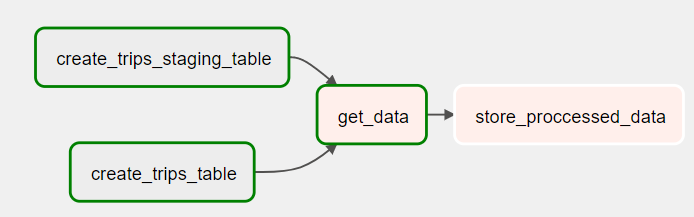

# Jobsity Challenge

This documentation try to explain how to run the ingestion data and RestAPI.

Before run, certified that you have docker on your machine.
> OBS.: I'm using here a Windows 11 machine

## 1. Install requirements

To ingest the data and apply some transformation I propose a solution that uses **Airflow**. After ingestion, I store the data
on **Postgres**.  

The rest api is build using **FastAPI**.

### 1.1 Install Airflow Dependencies

All the airflow dependencies are conteinerazed on `docker-compose.yml`. So, to run, try this:

`$: docker compose up -d`

Start airflow:

`$: docker compose up -d airflow-init`

### 1.2 Check Airflow is okay.

Open browser on url http://localhost:8080
* username: airflow
* password: airflow

### 1.3 Check if DAG already
On DAGS screen there are a input box called "Search Dags". Type
on box the DAG **process-trips-data**.

### 1.4 Add Connection on Airflow Configuration
To create one via the web UI, from the "Admin" menu, select "Connections", then click the Plus sign to "Add a new record" to the list of connections.

* Connection Id: `tutorial_pg_conn`
* Connection Type: `postgres`
* Host: `postgres`
* Schema: `airflow`
* Login: `airflow`
* Password: `airflow`
* Port: `5432`

### 1.5 What the DAG really does
The DAG has three stages:
* 1. The fisrt stage is divides by two steps:
    * 1.1. Create `trips_staging` table on database
    * 1.2. Create `trips` table on database
* 2. Read `.csv` file and load the data on `trips_staging` table. 
* 3. Get the data stored in `trips_staging` table, apply a transformation to split the point's columns string into a column to represent point `x` and `y`. For example, `origin_coordinate` will split to `origin_coordinate_x` and `origin_coordinate_y`.

Representation of the DAG:

## 2. Install RestAPI Requirements

### 2.1 Using Docker

The container was created when the command to create airflow dependencies was executed.

#### 2.1.3 Open link browser to see the Swagger API:
http://localhost:8000/docs

### 2.2 Using Python Virtual Environment

Create Python Virtual Environment. I'm using Python 3.10.8:

`$: python -m venv venv`

#### 2.2.1 Windows:

`$: .\venv\Scripts\activate`

##### 2.2.1.2 Unix based system:

`$: source .\venv\bin\activate`

### 2.2.2 Install app dependencies:

`$: pip install -r requirements.txt`

### 2.2.3 Run RestAPI on specific port

`$: uvicorn main:app --host "0.0.0.0" --port 8000 --reload`
